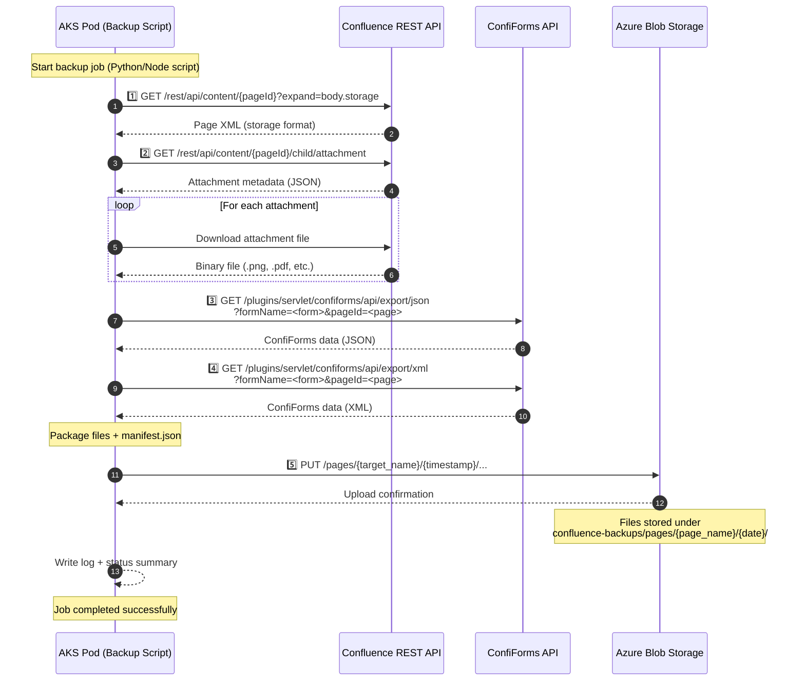

```mermaid
sequenceDiagram
    autonumber
    participant U as AKS Pod (Backup Script)
    participant C as Confluence REST API
    participant F as ConfiForms API
    participant B as Azure Blob Storage

    Note over U: Start backup job (Python/Node script)
    U->>C: 1️⃣ GET /rest/api/content/{pageId}?expand=body.storage
    C-->>U: Page XML (storage format)
    U->>C: 2️⃣ GET /rest/api/content/{pageId}/child/attachment
    C-->>U: Attachment metadata (JSON)
    loop For each attachment
        U->>C: Download attachment file
        C-->>U: Binary file (.png, .pdf, etc.)
    end

    U->>F: 3️⃣ GET /plugins/servlet/confiforms/api/export/json<br/>?formName=<form>&pageId=<page>
    F-->>U: ConfiForms data (JSON)
    U->>F: 4️⃣ GET /plugins/servlet/confiforms/api/export/xml<br/>?formName=<form>&pageId=<page>
    F-->>U: ConfiForms data (XML)

    Note over U: Package files + manifest.json

    U->>B: 5️⃣ PUT /pages/{target_name}/{timestamp}/...
    B-->>U: Upload confirmation

    Note over B: Files stored under<br/>confluence-backups/pages/{page_name}/{date}/
    U-->>U: Write log + status summary
    Note over U: Job completed successfully
```
